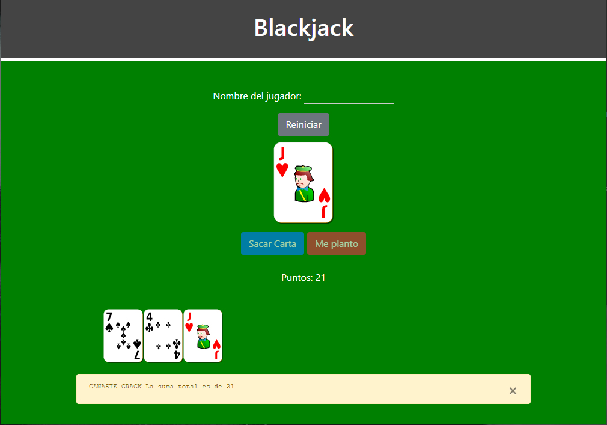

# BlackJack

## Descripción

Juego de cartas que consiste en sumar un valor lo más próximo a 21 sin pasarse. 

La aplicación sigue los principios del diseño responsive, está en formato ordenador y móvil. Las cartas son archivos SVG. Primeros pasos en JS, SCSS y Bootstrap.

## Caracerísticas

* HTML5, CSS3, JS
* SASS
* SVG
* [Bootstrap]( https://getbootstrap.com/)